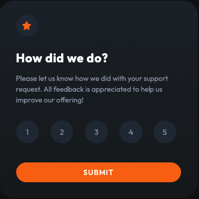

<h2 align="center">Interactive Rating Component</h2>

 

That's a challenge from <a href="https://www.frontendmentor.io/">FrontEnd Mentor</a>. It's a quite simple project, but I took some time thinking ways to complete the objective, even so I really liked the process and the final result.

 

Here are some screenshots of the project. If you want to test the component, <a href="https://edwardribas.github.io/rating-component">click me</a>.

   

   

